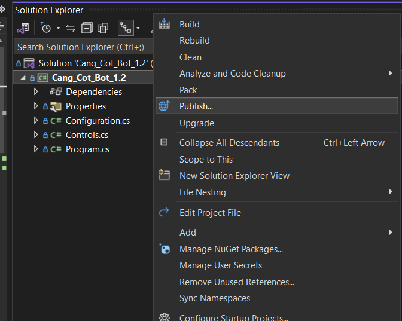
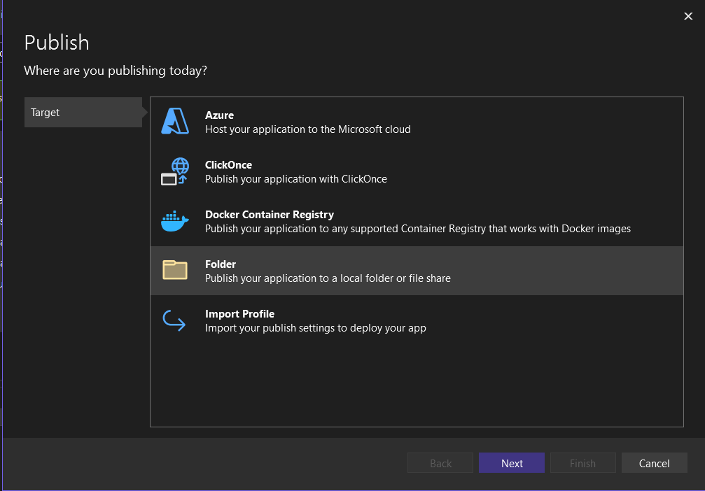
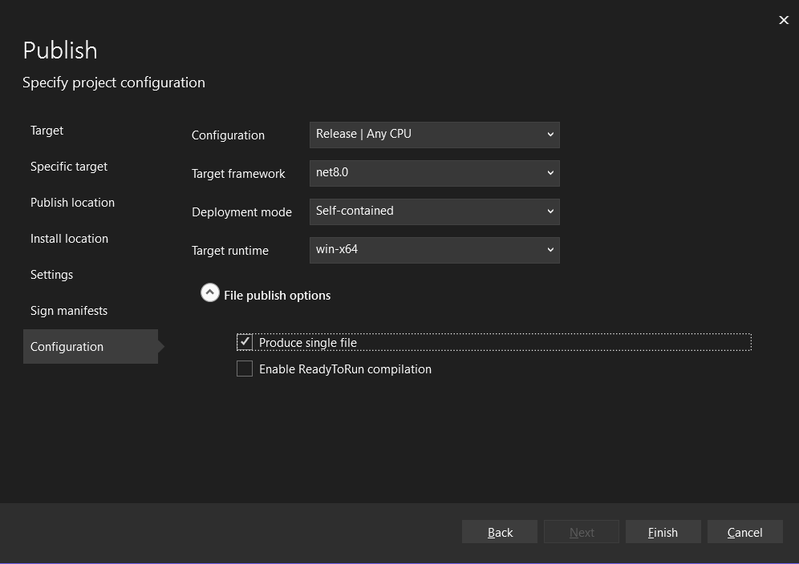
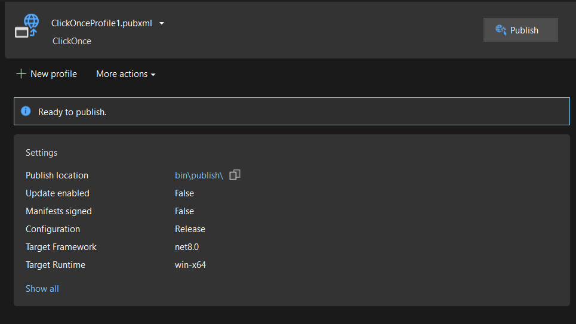
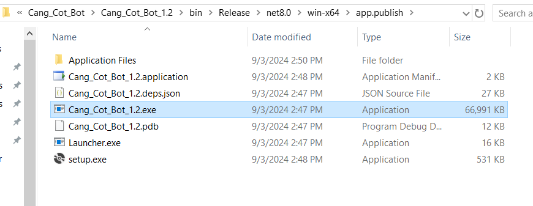

1. Tải `Cang_Cot_Bot.exe` về máy victim và chạy

2. Join telegram để tương tác với `Cang Cot Bot` https://t.me/+JbHc6jYqCgMxZTU1

3. Command: 
   ```
   /start - Chào bot
   /hi - Chào bot nhưng lại là hello
   /bye - Cũng là chào bot nhưng lại là bye bye
   /exec <command> - Thực thi lệnh cmd.exe trên máy victim
   ...<Cập nhật thêm sau>...
   Ngoài các lệnh này ra thì các lệnh khác không có gì (chỉ rep lại là nzbxcnmbzxc???X>XX>>X????)
   ```

Sử dụng Visual Studio 2022 để mở project

Sau khi sửa xong thì chuột phải vào project -> Publish



`New Profile`, Tiếp tục chọn `Folder`



Next đến cuối và config như sau



Finish và publish



Sau khi publish thì file exe có ở path như sau

